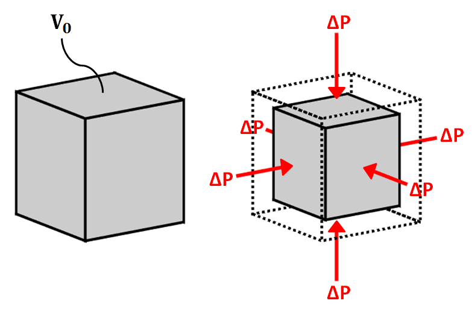
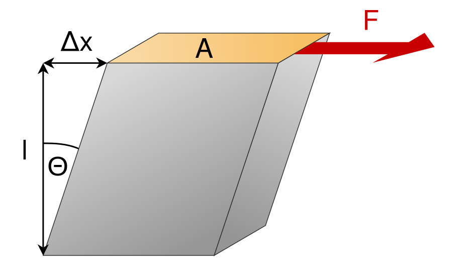
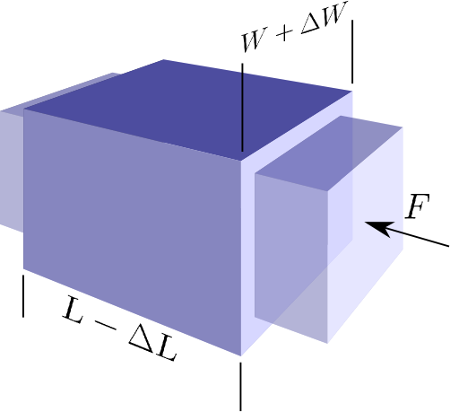

.. _bulk_shear:

Bulk and Shear Modulus
**********************

Elastic Deformation
===================

.. sidebar:: Normal and Shear Stress

	.. figure:: images/compressive.png
		:align: center

		Compressive normal stress

	.. figure:: images/tensile.png
		:align: center

		Tensile normal stress

	.. figure:: images/fig_shear_deformation.png
		:align: center

		Shear stress

When a mechanical force is applied to a material, it may experience a change in volume and/or shape.
If the deformation is elastic, it implies that once the applied force is removed, the material will return to its original volume and shape.
As a result, elastic deformation conserves energy.
Elastic deformation is commonly described in terms of stress and strain.

Stress
------

Stress is defined as the external force applied to a body divided by the cross-sectional area of the body over which the force is applied.
There are two main types of stress: normal stress and shear stress.
Normal stress is perpendicular to the surface of an object whereas shear stresses are tangential.
Normal stresses can be further divided into compressive and tensile stresses.
Compressive, tensile and shear stress are illustrated in the figure to the right.
Stress is a force per unit area and has SI units units of N/m :math:`\! ^2`.

Strain
------

Strain defines the deformation of a material under the influence of an applied stress.
When a body is stressed it may undergo a change in size and shape.
If this occurs, the body is said to be "strained".
For relatively small strains, the body will recover its original shape and volume when the stress is removed.
This is known as "elastic strain".
If the strain is too large, then the body deforms **plastically** and may even fracture.
Unlike elastic strain, plastic strain permanently alters the shape of the body.

.. figure :: ./images/stressstrain.png
	:align: right
	:figwidth: 35%

	Elastic and plastic deformation

The figure below plots how strain (horizontal axis) accumulates as stress (vertical
axis) is applied. While behaviour is elastic, increasing or decreasing the
stress does nothing to permanently change the material. Once stress is sufficient to make
material behave plastically, reducing the stress results in reduced strain
along a different path on the graph. Once the fracture point is reached, the
strain is released by breaking.

Material Elastic Properties
===========================

In this course---and for the vast majority of seismic analysis---we will assume that seismic waves cause the earth to undergo linear elastic deformation. In other words, we assume a linear relationship between stress and strain. This is known as Hooke's law. For a given material, that relationship can be characterized by a set of two independent material parameters that characterizes the strains produced as a result of various stresses. These parameters are intrinsic properties of the material. The parameters, or elastic moduli, can be defined in several ways and are also known as Lamé parameters. The most common set of parameters in seismology are the bulk and shear moduli. Young's modulus and Poisson's ratio are also commonly used. We describe these quantities here.

Bulk Modulus and Shear Modulus
------------------------------

**Bulk Modulus**

	Bulk modulus diagram.

The bulk modulus (:math:`K`) defines the resistance of a material to elastic compression.
As a result, it is sometimes referred to as the modulus of incompressibility.
When a block of material is subjected to compressional forces, its volume decreases and it becomes more dense (see figure).
Once the compressional force is removed, the block of material returns to its original size if the deformation is elastic.
The bulk modulus characterizes the compressional deformation as follows:

.. math::
    K = - V_0 \frac{\Delta P}{\Delta V}

where :math:`V_0` is the original volume of material, :math:`\Delta P` represents the pressure being applied to the material and :math:`\Delta V` is the resulting change in volume.

**Shear Modulus**

	Shear modulus diagram.

The shear modulus (:math:`\mu`) defines how resistant a material is to shear stress.
As a result, it is sometimes referred to as the modulus of rigidity.
When a block of material is subjected to a shear stress, it experiences a shear strain (see figure).
The shear modulus defines the ratio of shear stress to shear strain:

.. math::
    \mu = \frac{Stress}{Strain} = \frac{F l}{\Delta x A}

where the shear stress is represented by a force (:math:`F`) per unit area (:math:`A`).
Shear strain represents a tangent angle between the shear deformation (:math:`\Delta x`) of the material along the direction of force and the perpendicular dimension (:math:`l`) of the block of material.

Young's Modulus and Poisson's Ratio
-----------------------------------

**Young's Modulus**

		Young's modulus and Poisson's ratio diagram. `Image <http://www.subsurfwiki.org/wiki/File:Elastic_Poisson_ratio.png>`__ from `Subsurface Wiki`_, licensed under `CC BY 3.0`_.

Young's modulus is defined to be the ratio of longitudinal normal stress to longitudinal normal strain.
Consider the rectangular prism shown below with square cross-sectional area :math:`A = W^2` and length :math:`L`.
A force :math:`F` applied normal to the axis of the prism, distributed over the cross-sectional area, will generate a normal stress of :math:`P = F/A`.
If this stress generates a reduction in length of the prism of :math:`\Delta L`, the Young's modulus of the prism material is

.. math::
	E = \frac{P}{\Delta L/L}

**Poisson's Ratio**

As a result of the longitudinal stress described above the cross-sectional area of the prism may be increased, compensating for the reduction in length. Let us define the cross-sectional strain as :math:`\Delta W / W`. **Poisson's ratio** is the ratio of transverse strain to longitudinal strain due to a longitudinal stress:

.. math::
	\sigma = \frac{\Delta W / W}{\Delta L/L}

Note that it is possible for :math:`\sigma` to be zero. The decrease in length could be compensated for by decrease in pore space for example. Cork is an example of such a material.

**Other Elastic Parameters**

In addition to the bulk modulus, shear modulus, Young's modulus and Poisson's ratio, there are a multitude elastic parameters which can be used in pairs to define Hooke's law. We will not cover the entire range of parameters in this course. A table showing the relationships between the various parameter pairs can be found `here <https://en.wikipedia.org/wiki/Lame_parameters>`_.

