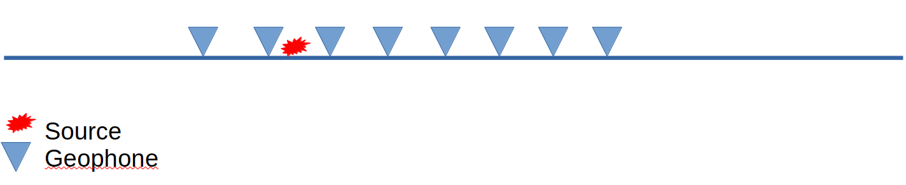

.. _seismic_refraction_index:

Refraction seismics
*******************

.. figure:: ./images/icon_refrac.gif
   :align: right
   :scale: 110 %

In refraction seismics, we determine the seismic velocity of the
subsurface by measuring the dip of wave arrivals. To carry out such a
survey, we first set up geophones along a line. Then we create seismic
waves at several shot locations (e.g., by striking the ground with a
hammer or using explosives).

|

|
	   
For each shot location, we determine subsurface velocities using the
approach explained in section :ref:`travel_times`. We can then combine
the information to determine subsurface variation along a
profile. This can be done using an inversion approach, where the input
data are the arrival times of the refracted waves, and the output is a
subsurface velocity image.

	   
Contents:

.. toctree::
   :maxdepth: 1

   traveltimes
   seismic_refraction_dipping_layers
   seismic_refraction_irregular_layers
   seismic_refraction_interpretation
   
